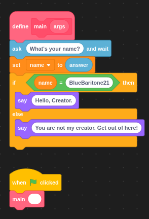

# Lesson 2: A Bit Complex

So, you should have read Lesson One. read it? Okay!

## The Scratch Program for Today



## Python

First off, what are we making today? A program to talk to you, that's what! (I'm sorry. Heh Heh. 😏)

I'm gonna do this a bit diffrently today. I'll explain the conepts FIRST, then make them into a program. lets start with the base for every program:

```python
def main():
    #code here...
    return #Just ending the main without putting anything in it.

if __name__ == '__main__':
    main()
```

Next, we need some way to know what your name is, and some way to remember. That's were **variables** come into play.

So, what are Variables? Well, think of a box.


Now, Imagine that there is a lable on that box, and you can put stuff in the box. That is a variable.

Well, not exactly. You could put anything in a box, but only a specific *type* of things in a variable. You will see that works in the java portian, but now I'll tell you what some of the types are.

name (Python)|name (Java)| meaning
---|---|---
`str()` |`String`| A sequence of text
`int()`|`int` | A number with no decimal places.
`float()`|`float`| A number with decimal places.
`bool()`|`bool`|A value that can only be `True` or `False`

We can make Variables in Python like so:

```python
VariableName = type(value);
```

Let's put that in the code:

```python
def main():
    name = str("We Don't Have a name yet..")
    #more code here...

if __name__ == '__main__':
    main()
```

Now, let's actually find out what the user's name is. Shall we?

First, I'll need to explain what what *IO* is.

According to Wikipedia:

>input/output (I/O, or informally io or IO) is the communication between an information processing system, such as a computer, and the outside world

So we need to do the **I** in **I/O** and read an input. In Python it's with the... `input()` function! Like this:

```python
var=input("Prompt")
```

Let's put that in the code:

```python
def main():
    name = str("idk, something")
    name = input("What's you name? ")
    #even more code here...

if __name__ == '__main__':
    main()
```

Now were getting somewhere! Next, we'll get fancy!

So far, we've just used `String`s. Now, were going to use a different type, a `bool`! Why? We're gonna make it give different greatings to different people. hOw Do YoU dO tHaT? `if` statments.

*If* statements are a way to control the flow on a program. basicly, if this is `True`, do this, otherwise, do that. They take a `bool` as input.

So, how do you use a bool?

According to Wikipedia:

>Variables are [either] true and false, usually denoted 1 and 0, respectively. ... The main operations of Boolean algebra are the conjunction (and) denoted as ∧, the disjunction (or) denoted as ∨, and the negation (not) denoted as ¬.

In Python, you can just type `and`, `or`, or `not` to use the logical operators.

Also, you can test for **equality** (or if something is equal to something else) with `==`. To test for *non equality*, type `!=`

Let's put that in.

```python
def main():
    name = str("idk, something")
    name = input("What's you name? ")
    if(name == "BlueBaritone21"):
        print("Hi, BlueBaritone21")
    else:
        print("Hey.")
    #even even more code here...

if __name__ == '__main__':
    main()
```

Wow, weve done it!
