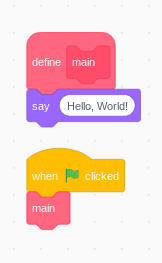

# Lesson 1: Hello, World


>The Above Scratch program will say Hi!
>
>Just Remember the Say block is part of the main custom block.

## Writing the same thing in Python

```python
def main():
    print("Hello, World!")

if __name__ == '__main__':
    main()
```

Running this will result in `Hello, Wold!` being printed on the screen!

 Congrats! you wrote your first Python Program! Show your freinds!

### Okay, what just happened?

First off, **def main():**
When you type `def`, you are saying that you want to make a *function*, which is a reusable peace of code **(like a custom block!)**. The `main()` means that you are calling the function **main** and that there are no parameters, which are like the fields in a custom block.
The `print` command is precceded by 4 spaces, which mean that it's part of the `main` function.

Finaly, `if __name__ == '__main__':` Whew. First of, `if`. We will go into more detail in Lesson 2, but for now, just know that the main function that is indented after it will be run only when `__name__ == '__main__'`. But what does `__name__ == '__main__'` mean? Well, `__name__` is a special variable (again, wait for *lesson 2*). and `'__main__'`, along with `'Hello, World!'` is a **string**, or text. Finaly, `==` means *equal to*.

So Basicly the Python code just means that the main peice of code is to say 'Hello, World!', and to run the main code, but only if this is this is run directly.

**Whew!**

## Now for the Java code

```java
//File: JavaHello.java

public class JavaHello{
    public static void main(String[] args){
        System.out.print("Hello, World!");
    }
}
```

### Uhh, what?

Okay. This is very different from the Python code. So what does it mean? Well first, `public class` `JavaHello` is like a sprite. It can be made into an **object**, like cloning a sprite!
>Just note that the class name (the `JavaHello`) needs to be the same as the filename (*JavaHello.java*).

Next, `{}` is used to mean that the code belongs to the **block**, like indenting in Python or puting code in the **C blocks** or **Hat Blocks** in Scratch.

Okay, this is why we used the `main` function in Scratch and Python (*Technicly* you could write the Python code directly into the file, like in the example below.)

```python
print("Hello, World!")
```

However, in Java, you **MUST** have a main function. Java looks for the main function in the class and runs that first.

So, what does `public static void` mean? Well, `public` means that it can be seen and called from outside the class. `static` means that the funtion will never change after it is run (unless you change its code). and `void` means that it dosn't return anything (*Lesson 2*). `String[] args` means that it can read **command-line arguments** (*Uhh, later!*) Don't worry about it for now.
