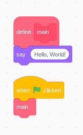

# Java and Python

## For Scratch users

---

## Lesson 1: Hello, World


>The Above Scratch program will say Hi!
>
>Just Remember the Say block is part of the main custom block.

Now let's write the same thing in Python!

```python
def main():
    print("Hello, World!")

if __name__ == '__main__':
    main()
```

Running this will result in `Hello, Wold!` being printed on the screen!

 Congrats! you wrote your first Python Program! Show your freinds!

### Okay, what just happened?

First off, **def main():**
When you type `def`, you are saying that you want to make a *function*, which is a reusable peace of code **(like a custom block!)**. The `main()` means that you are calling the function **main** and that there are no parameters, which are like the fields in a custom block.

Finaly, the `print` command is precceded by 4 spaces, which mean that it's part of the `main` function.
